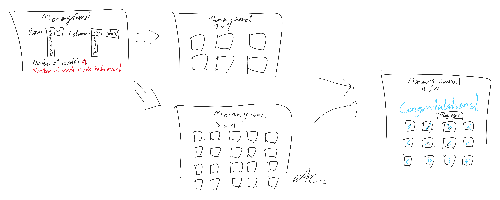

# Browser Number Matching Game

A simple card matching game where you match numbers. Has customization for amount of cards and amount of cards per matching set.

## Getting started - Wanna play?

You can find the game here: https://uriapete.github.io/BrowserMatchingGame/

Enter into all of the input prompts before starting. Feel free to tweak the settings to your liking!
To start, click the start button. The cards will appear below. You can restart at any time by clicking start again.
Click on the cards to flip them. They will reveal the other side. The cards will automatically flip back once you flip over the amount of cards set in the "matches" setting.

Have fun!

## Screenshots

Page on arrival:

Setting up game:

Set up warning:

An example of a game:

Another example of a game:

Congratulations message:

## Technologies used

- HTML
- CSS
- Typescript / Javascript
    - Document Object Manipulation (DOM)

## Next steps

You can see the user stories below for planned features. But to summarize:
- Fail & strike system: the game will end if you fail a match too many times
    - Customizable max amount of fails
    - Deck reveals all cards after failed game
- Warning for restarting game
- Warning for large amount of cards
- Timer & best times
- Progress bar

## User stories:

- [x]As a user, I want to be able to customize the game to use up to 10 rows by 10 columns with an even amount of cards so that I can play with less or more cards if I want to.
    - [x]BONUS: As a user, I want to be able to customize the game to use any number of rows and columns as long as the number of cards are even so that I can fully customize how big the game will be and how many cards there will be.
    - []BONUS: As a user, I want to see a warning when I choose to play with a large amount of cards so that I know if a game might take a while and take up more space.
    - [x]BONUS: As a user, I want to be able to customize the game to match 2, 3, 4, or more cards so that I can further control the game and further enjoy playing how I want to play.
- [x]As a user, I want to see the cards randomized so that I will always have a new game instead of repeating the same exact game.
- [x]As a user, I want to be able to choose to have the game either reveal all the cards at the beginning or start with the cards' contents hidden so that I can make the game slightly easier or harder for me.
- [x]As a user, I want to see the cards' contents revealed when I click on each card so I can see what's in the card I clicked on.
- [x]As a user, I want the game to automatically flip the cards back over when I fail to match them so that I can try to match again.
- []As a user, I want the game to end and reveal all of the cards if I fail to match cards 3 times (or more on bigger games) so that I can have a bit of challenge in the game.
    - []BONUS: As a user, I want to be able to customize the amount of times I can fail so I can give myself a handicap if I want.
- [x]As a user, I want the game to keep matched cards flipped over so I can see my progress in the game.
    - BONUS: As a user, I want to see a progress bar showing my progress so I can clearly see my progress in the game.
- [x]As a user, I want the game to congratulate me if I manage to find all of the matches so that I know when I've completed the game and I can get the satisfaction of completing the game.
    - []BONUS: As a user, I want the site to tell me how long I am taking/took so that I can have a challenge in being timed.
    - []BONUS: As a user, I want the site to show my top times so I can compare my times.
- [x]As a user, I want to be able to restart the game whether during or after a game so that I can try the game again.
    - []BONUS: As a user, I want the game to warn me before restarting during an unfinished game so that I don't accidentally erase my progress.

## Wireframes:

Page on arrival:

Page during play:

## Sketches:

## Pseudocode:
Please see the files in the "pseudocode" folder.
